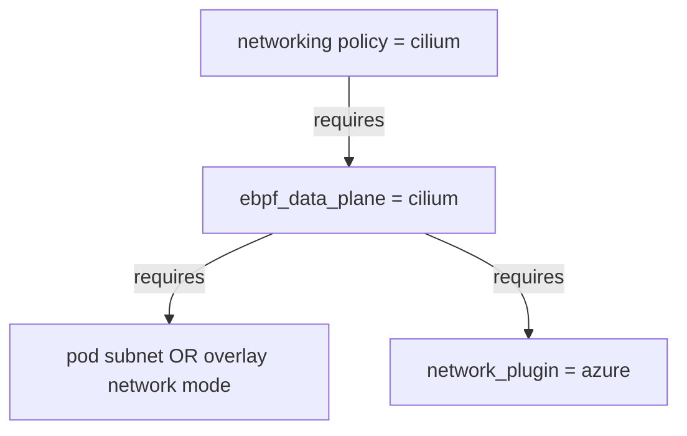

# AKS Flux v2 add on demo

AKS has a built-in integration with Flux v2. It also has `Cilium` networking policy support. This repo showcases them.

## Prerequisites

- Fork this repo
- Create a new _Azure Entra Application_ and with _Federated credentials_ assigned to your repo.
- Create the following GH Actions secrets:
  - `azure_client_id`: The _Application (client) ID_ of the _Azure AD Application_.
  - `azure_tenant_id`: The _Directory (tenant) ID_ of the _Azure AD Application_.
  - `azure_subscription_id`: The _Subscription ID_ of the _Azure Subscription_.
- Be sure to give the _Azure Entra Application_ you created permissions to the _Azure Subscription_ you are going to use.
- Create a storage account and update the main.tf backend configuration with the storage account name and container name.
- Be sure to give the _Azure Entra Application_ you created permissions to the _Storage Account_ you are going to use with the _Storage Blob Data Contributor_ role and _Storage Account Key Operator Service Role_ role.

### Register provider

The following providers are used in the Terraform code and needs to be registered in the Azure Subscription:

```bash
az provider register --namespace Microsoft.Kubernetes
az provider register --namespace Microsoft.ContainerService
az provider register --namespace Microsoft.KubernetesConfiguration
```

## Using Azure Storage Account for Terraform state

The Terraform state is stored in an Azure Storage Account configured in the `./terraform/main.tf` file.

## Terraform Test

The repo uses Terraform Test with a setup function `./terraform/tests/setup/main.tf` to test the Terraform code.

Terraform Test enables TDD, and testing the modules in isolation in a controlled environment. Try to write the test before the code, e.g.,

- [Failing test](https://github.com/fredrkl/aks_fluxv2_demo/commit/f0b02b9f257c8ed78ef234913acd71263c41273e)
- [Passing test](https://github.com/fredrkl/aks_fluxv2_demo/commit/370035a322a512e10f44f8667438ed050f91edc9)

- [Failing test due to misconfiguration](https://github.com/fredrkl/aks_fluxv2_demo/actions/runs/7538534956/job/20519248990)

By writing the test first, you can be sure that the code you write is testable. Terraform test running localy enables a faster developer flow. It also helps you to early think about code design.

## Cilium networking policy



Unfortunately, there is [no L7 policy support in AKS native cilium networking policy](https://learn.microsoft.com/en-us/azure/aks/azure-cni-powered-by-cilium#limitations).

## Pre-commit hooks for terraform files (optional)

> :exclamation: The pre-commit hooks are only running on staged files.

To set up pre-commit hooks for terraform files, run the following commands:

```bash
brew install pre-commit
pre-commit install
```

If you want to uninstall the pre-commit hooks, run the following command:

```bash
pre-commit uninstall
```

## Build status (main branch)

[](https://github.com/fredrkl/aks_fluxv2_demo/actions/workflows/terraform.yaml)
